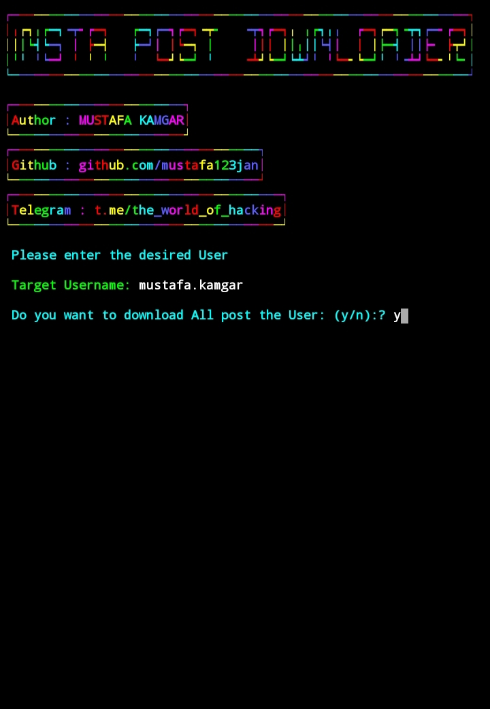
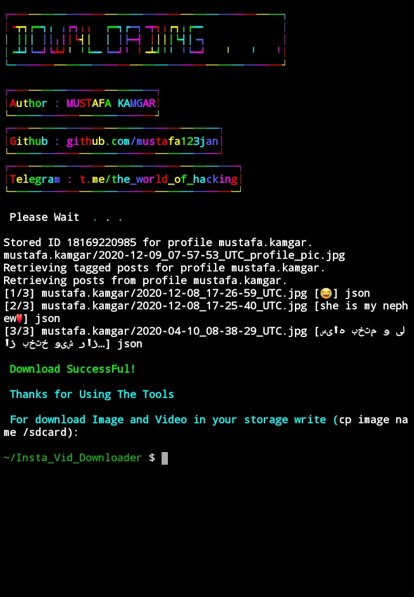

<p align="left">
<a href="#"></a>
</p>


## Installation :

* `apt update`
* `apt install python`
* `pip instaloader`
* `apt install git python python2 -y`
* `git clone https://github.com/mustafa123jan/Insta_Vid_Downloader.git`
* `cd Insta_Vid_Downloader`

#### > Run : `python InstaVideo.py`


## Single Command :
```
apt update ;pip install instaloader ;apt install git python python2 -y ;git clone https://github.com/mustafa123jan/Insta_Vid_Downloader.git ; cd Insta_Vid_Downloader ; python InstaVideo.py
```
#### A simple and easy Post downloader for Instagram
### I am Not Responsible for the Misuse of this Tool !!
<br>
<p align="center">


</p>

### << I AM NOT RESPONSIBLE FOR MISUSE >>
### <<< If you copy , Then Give me The Credits >>>

## Features :

#### [+] Easy for Beginners !

## Find Me on :
[](https://github.com/mustafa123jan)
[](https://t.me/the_world_of_hacking)
[](https://www.instagram.com/mustafa.kamgar)
[](https://m.me/mustafa.kamgar.2)